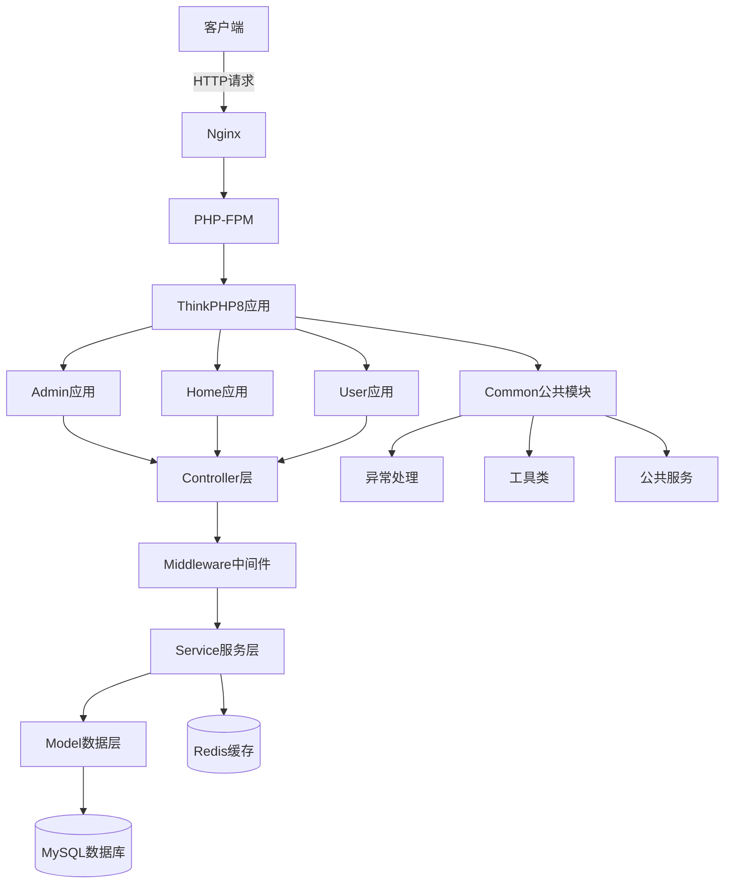
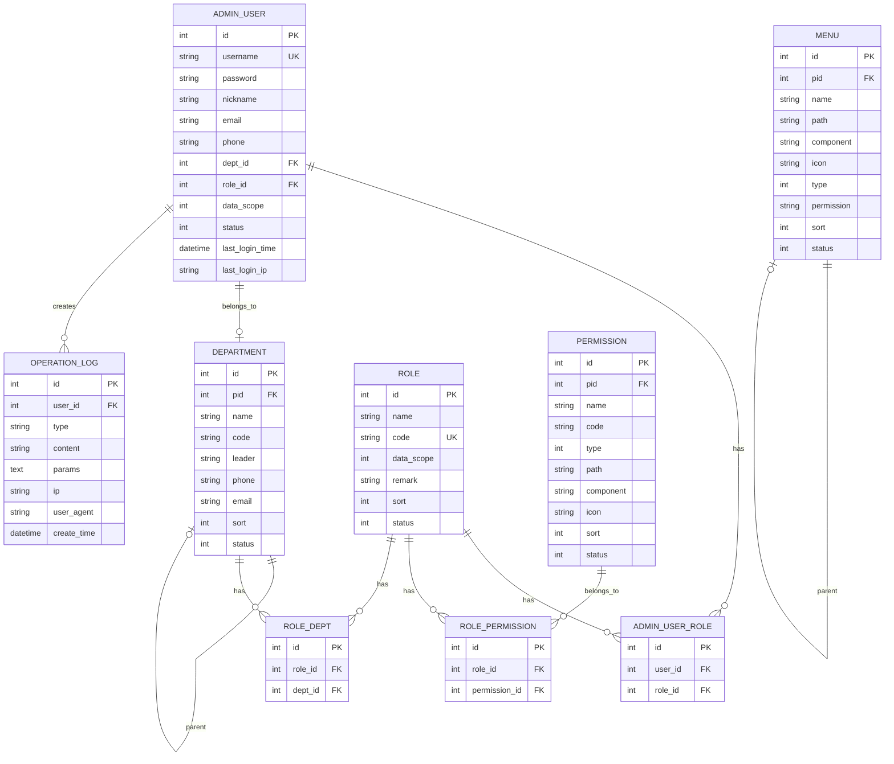
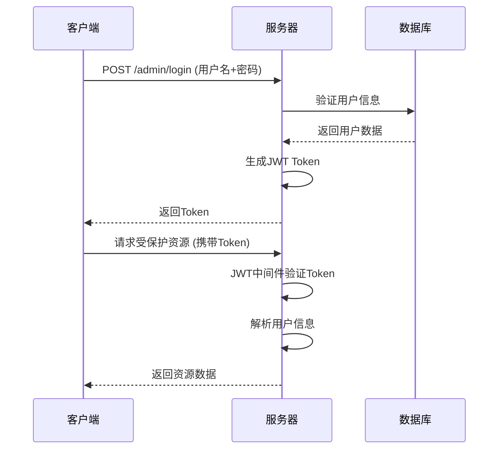
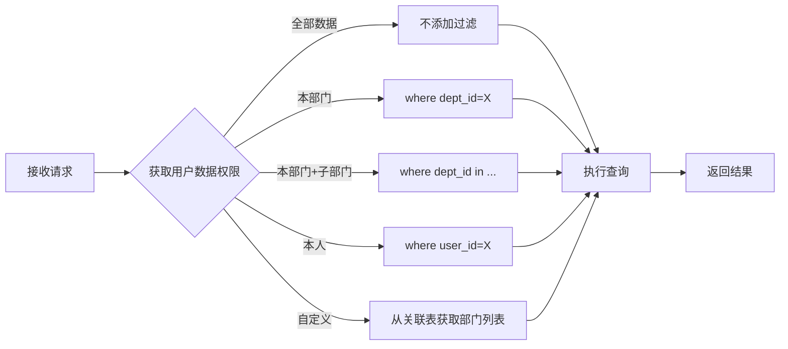

# ThinkPHP8 多应用分层架构系统 - 项目设计文档

## 1. 系统架构



## 2. 数据库设计（ER图）



## 3. 核心接口清单

### 3.1 认证模块（AuthController）

| 接口地址 | 请求方式 | 说明 | 是否需要认证 |
|---------|---------|------|-------------|
| `/admin/login` | POST | 用户登录 | ❌ |
| `/admin/refresh` | POST | 刷新Token | ✅ |

### 3.2 用户管理（UserController）

| 接口地址 | 请求方式 | 说明 | 是否需要认证 |
|---------|---------|------|-------------|
| `/admin/users` | GET | 用户列表 | ✅ |
| `/admin/users` | POST | 创建用户 | ✅ |
| `/admin/users/:id` | PUT | 更新用户 | ✅ |
| `/admin/users/:id` | DELETE | 删除用户 | ✅ |
| `/admin/users/:id/status` | POST | 设置用户状态 | ✅ |

### 3.3 角色管理（RoleController）

| 接口地址 | 请求方式 | 说明 | 是否需要认证 |
|---------|---------|------|-------------|
| `/admin/roles` | GET | 角色列表 | ✅ |
| `/admin/roles` | POST | 创建角色 | ✅ |
| `/admin/roles/:id` | PUT | 更新角色 | ✅ |
| `/admin/roles/:id` | DELETE | 删除角色 | ✅ |

### 3.4 操作日志（LogController）

| 接口地址 | 请求方式 | 说明 | 是否需要认证 |
|---------|---------|------|-------------|
| `/admin/logs` | GET | 日志列表 | ✅ |
| `/admin/logs/:id` | GET | 日志详情 | ✅ |

### 3.5 文档（SwaggerController）

| 接口地址 | 请求方式 | 说明 | 是否需要认证 |
|---------|---------|------|-------------|
| `/admin/swagger` | GET | Swagger JSON | ❌ |
| `/admin/swagger/ui` | GET | Swagger UI | ❌ |

## 4. UI/UX 规范

### 4.1 颜色规范

- **主色调**: `#409EFF` (Element Plus Blue)
- **成功色**: `#67C23A` (Green)
- **警告色**: `#E6A23C` (Orange)
- **危险色**: `#F56C6C` (Red)
- **信息色**: `#909399` (Gray)

### 4.2 字体规范

- **标题字体**: 
  - H1: 24px, 粗体
  - H2: 20px, 粗体
  - H3: 18px, 粗体
  
- **正文字体**: 14px, 常规
- **辅助文字**: 12px, 常规
- **字体家族**: -apple-system, BlinkMacSystemFont, "Segoe UI", Roboto, "Helvetica Neue", Arial, sans-serif

### 4.3 间距规范

- **小间距**: 8px
- **常规间距**: 16px
- **大间距**: 24px
- **特大间距**: 32px

### 4.4 卡片圆角

- **按钮圆角**: 4px
- **卡片圆角**: 8px
- **弹窗圆角**: 12px

### 4.5 阴影规范

- **浅阴影**: `box-shadow: 0 2px 4px rgba(0, 0, 0, 0.12)`
- **中阴影**: `box-shadow: 0 4px 12px rgba(0, 0, 0, 0.15)`
- **深阴影**: `box-shadow: 0 8px 24px rgba(0, 0, 0, 0.2)`

## 5. 技术实现要点

### 5.1 JWT认证流程



### 5.2 数据权限应用



### 5.3 缓存策略

| 缓存项 | Key格式 | 过期时间 | 更新时机 |
|--------|---------|---------|---------|
| 用户权限 | `admin_permission_{user_id}` | 1小时 | 权限变更时 |
| 菜单树 | `admin_menu_tree` | 24小时 | 菜单变更时 |
| 角色信息 | `admin_role_{role_id}` | 1小时 | 角色变更时 |

### 5.4 定时任务配置

| 任务名称 | 执行频率 | 任务描述 |
|---------|---------|---------|
| 清理过期缓存 | 每天0点 | 清理过期的缓存数据 |
| 归档操作日志 | 每周日2点 | 将30天前的日志归档到历史表 |

## 6. 响应格式规范

### 6.1 成功响应

```json
{
  "code": 200,
  "msg": "success",
  "data": {
    // 业务数据
  },
  "timestamp": 1706256000
}
```

### 6.2 失败响应

```json
{
  "code": 400,
  "msg": "错误信息描述",
  "data": [],
  "timestamp": 1706256000
}
```

### 6.3 列表响应

```json
{
  "code": 200,
  "msg": "success",
  "data": {
    "list": [],
    "total": 100,
    "page": 1,
    "limit": 15
  },
  "timestamp": 1706256000
}
```

## 7. 安全策略

1. **密码加密**: 使用 `password_hash()` 进行bcrypt加密
2. **JWT签名**: 使用HS256算法签名，密钥存储在环境变量
3. **SQL注入防护**: 使用ORM预处理语句
4. **XSS防护**: 输出时进行HTML转义
5. **CSRF防护**: API使用JWT，无需CSRF Token
6. **访问频率限制**: 建议在Nginx层配置限流

## 8. 性能优化

1. **数据库索引**: 所有外键和常用查询字段建立索引
2. **Redis缓存**: 高频访问数据使用Redis缓存
3. **懒加载**: 关联数据按需加载
4. **连接池**: 使用数据库连接池
5. **OPcache**: 启用PHP OPcache加速
